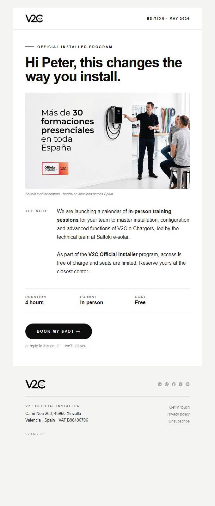
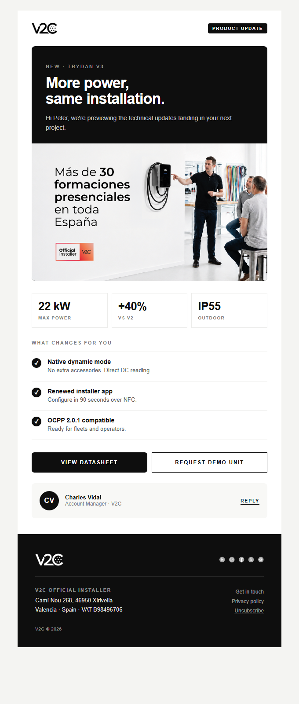
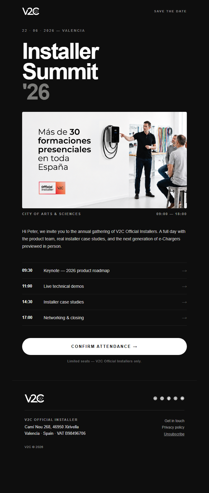

# V2C Media Kit · Email

Official V2C email design system. Templates, brand identity and guidelines for use by **V2C Official Installers**, authorized distributors, communication partners, agencies and press.

This repository complements the [official V2C graphic material](https://v2charge.com/material-grafico) (logos, videos, identity manual) with the email-specific component.

---

## What's inside

Three production-ready HTML email templates based on the V2C visual identity:

<table>
  <tr>
    <td align="center" valign="top" width="33%">
      <a href="./masters/editorial.html"></a>
      <br><br><strong>Editorial</strong>
      <br><sub>Newsletters, periodic updates.<br>Refined magazine, light background.</sub>
    </td>
    <td align="center" valign="top" width="33%">
      <a href="./masters/data.html"></a>
      <br><br><strong>Data</strong>
      <br><sub>Product announcements, technical updates.<br>Stats + features + signature.</sub>
    </td>
    <td align="center" valign="top" width="33%">
      <a href="./masters/bold.html"></a>
      <br><br><strong>Bold</strong>
      <br><sub>Events, launches, invitations.<br>Dark, dramatic, single focus.</sub>
    </td>
  </tr>
</table>

All templates follow professional email standards: `<table>`-based layout, inline CSS, 600px width, Outlook/Gmail/Apple Mail compatibility, mobile-responsive, GDPR-compliant footer, and per-recipient personalization.

---

## Who is this for?

- 🔧 **V2C Official Installers** communicating with their end-customer base while keeping V2C brand consistency
- 📦 **Authorized distributors** sending product or service communications
- 🎨 **Agencies and partners** producing V2C campaigns
- 📰 **Press and media** needing visual reference materials

---

## Getting started

### Option A — Direct download

Click the green **"Code"** button above → **"Download ZIP"**. You'll get the templates, customize them in your favorite HTML editor, and use them in your usual sending platform (Mailchimp, HubSpot, Brevo, Resend, etc.).

### Option B — Git (recommended for repeated use)

```bash
git clone https://github.com/V2Charge/v2c-media-kit.git
cd v2c-media-kit
```

### Option C — AI-assisted (fastest)

If you usually work with an AI assistant (Claude, ChatGPT, Cursor, Copilot…), open the folder in your AI-enabled editor and ask in natural language:

> *"Adapt the Editorial template for a hands-on training session about Trydan Pro on June 15th in Madrid. CTA: register. Languages: English, Spanish, French."*

The [`CLAUDE.md`](./CLAUDE.md) file teaches the AI how to preserve V2C brand consistency, keep the legal footer intact, and produce email-compatible HTML. It's written for LLMs but also serves as a solid technical reference if you customize templates by hand.

---

## Structure

```
masters/
  editorial.html     ← Template A
  data.html          ← Template B
  bold.html          ← Template C
examples/
  campaign.example.json
output/              ← Where your customized work goes (empty by default)
CLAUDE.md            ← Technical guide for AI assistants and developers
BRAND.md             ← Quick visual identity reference
LICENSE
README.md
```

---

## Customization

Each template uses **Handlebars variables** (`{{firstname}}`, `{{cta_url}}`, etc.) that you can:

- **Replace manually** before sending (find-and-replace)
- **Leave as-is** if your sending platform supports Handlebars merge tags (Resend, HubSpot Marketing Email, Mailchimp with conversion, etc.)
- **Generate a structured JSON** with your AI assistant, ready to upload to a compatible platform

Common variables:

| Variable | Meaning |
|---|---|
| `{{firstname}}` | Recipient's first name |
| `{{lastname}}` | Recipient's last name |
| `{{company}}` | Recipient's company |
| `{{owner_firstname}}` | Your first name (or the account manager's) |
| `{{owner_email}}` | Your contact email |
| `{{cta_url}}` | Primary button URL |
| `{{unsubscribe_url}}` | Unsubscribe link (mandatory under GDPR) |

Complete list of all content placeholders in [`CLAUDE.md`](./CLAUDE.md).

---

## Design guide

A visual-identity guide for keeping any V2C deliverable on-brand — presentations, slides, documents and graphics, as well as these email templates. It follows the [V2C corporate identity manual](https://v2charge.com/graphic-material/) and is written so an AI assistant can apply it directly.

### Brand essence

- **Minimal black & white.** The default palette is monochrome. Color is the exception, not the rule.
- **Editorial.** Think of a refined magazine or a premium product brochure: clear hierarchy, uppercase eyebrows, tight headlines, lots of breathing room.
- **Modern and technical, but human.** Clean lines and structure, without feeling cold or corporate-generic.
- **Restraint.** When in doubt, remove. One idea per slide, one focal point per layout.

### Color palette

| Role | Hex | Use |
|---|---|---|
| Primary black | `#0E0E0E` | Main text, dark backgrounds, primary shapes |
| White | `#ffffff` | Light backgrounds, text on dark |
| Light grey | `#F4F4F2` | Section backgrounds, subtle surfaces |
| Very light grey | `#F8F8F6` | Cards, secondary surfaces on white |
| Border grey | `#ECECEA` | Dividers, lines, table borders |
| Secondary text grey | `#7A7A78` | Captions, eyebrows, metadata, footnotes |
| Body text grey | `#1F1F1F` | Long-form body text |

- Build everything from black, white and the greys above.
- The historical V2C red (`#e30613`) is **not** used by default. Only introduce an accent if the brief explicitly asks for it — then use it sparingly (a single highlight, never large fills).
- Maintain strong contrast: black text on white/light grey, white text on black.

### Typography

- **Typeface:** Montserrat. Fallback: Arial / Helvetica / system sans-serif.
- **Weights:** 400 (regular), 600 (semibold), 700 (bold). Avoid thin/light weights for body text.

| Element | Treatment |
|---|---|
| Eyebrow / label | Uppercase, weight 600–700, letter-spacing `0.14em`–`0.22em`, small (≈11–13px), often in secondary grey `#7A7A78` |
| Display headline | Weight 700, large, negative letter-spacing (`-0.025em` to `-0.045em`), tight line-height (`0.92`–`1.05`) |
| Subheading | Weight 600, moderate size, normal tracking |
| Body | Weight 400, line-height `1.5`–`1.7`, comfortable measure |

**Pattern:** the recurring V2C text block is **eyebrow → headline → body**.

### Logo

All official logo files are on the [graphic material page](https://v2charge.com/graphic-material/).

| Version | Use | Link |
|---|---|---|
| Black (PNG) | On light backgrounds | https://v2charge.com/wp-content/uploads/2022/01/logotipo-v2c-black.png |
| White (PNG) | On dark backgrounds | [graphic material page](https://v2charge.com/graphic-material/) |
| Vector (SVG) | Print, large formats, scaling | [graphic material page](https://v2charge.com/graphic-material/) |

- **Clear space:** keep generous empty space around the logo; never crowd it.
- **Sizing:** legible but never dominant — it frames the work, it isn't the hero.
- **Pick the right version:** black on light backgrounds, white on dark.
- **Never:** stretch, distort, recolor, add effects/shadows/gradients, or rebuild it in another font.

### Layout & composition

- **Whitespace first.** Generous, consistent margins. Let elements breathe.
- **Strong grid & alignment.** Prefer left-aligned editorial layouts; centered for hero/cover moments.
- **One focal point.** Each slide/page communicates a single idea.
- **Consistent rhythm.** Reuse the same margins, type sizes and spacing throughout.
- **Dividers:** thin `#ECECEA` rules, not heavy boxes.

Slide archetypes: **cover** (full-bleed black or white, large headline + small eyebrow + logo), **section divider** (full black slide, white headline), **content** (light background, eyebrow + headline + body), **data** (monochrome charts, minimal gridlines, no 3D).

### Imagery & graphics

- **Photography:** clean, modern, well-lit; products on neutral or real-world contexts.
- **Treatment:** restrained, near-monochrome feel alongside the B&W system.
- **Icons:** simple monochrome, consistent stroke weight.
- **Charts:** black and grey tones, thin axes, no shadows or gradients.

### Do / Don't

**Do:** lead with black/white/grey · use Montserrat with clear hierarchy and uppercase eyebrows · leave generous whitespace · one idea per slide.

**Don't:** add color unless the brief requires it · mix typefaces or use thin weights for small text · apply shadows/gradients/glows/3D · distort or crowd the logo · fill every corner.

### Tone of voice

Professional, clear and concise. B2B audience (installers, distributors, partners). No hype, no salesy or exclamation-heavy copy. Let the design and message stay calm and confident.

---

## Legal footer

All templates include a **legal footer block** marked with `<!-- LOCKED -->...<!-- /LOCKED -->` comments. It contains:

- VAT ID B98496706
- Registered address: Camí Nou 268, 46950 Xirivella, Valencia, Spain
- Link to the [privacy policy](https://v2charge.com/privacy-policy/)
- Unsubscribe variable (`{{unsubscribe_url}}`)
- V2C social media icons

**Do not modify this block** — it's required under GDPR / Spanish LSSI law, and the unsubscribe mechanism must remain functional. If you need to adapt it (e.g. you're an authorized distributor in another country with your own legal entity), contact the V2C communications team first.

---

## License and usage

These templates are **V2C property** and are made freely available for use by:

- V2C Official Installers in communications to their end customers
- V2C authorized distributors
- Agencies and partners contracted by V2C
- Press and media for reference

Use by unauthorized third parties is not permitted, nor is modification of the logo, legal footer or brand identity. For commercial use outside the above, contact the V2C communications team.

---

## Contact

To request new templates, report issues, or for any brand identity inquiries:

📧 **info@v2charge.com** — V2C Communications and Marketing team
🌐 **[v2charge.com/material-grafico](https://v2charge.com/material-grafico)** — full official graphic material

---

<details>
<summary><sub>Information for the V2C team</sub></summary>

<br>

If you're part of the V2C team (Official Installer, distributor, internal communications), you have access to the internal sending platform where you can upload the `output/campaign.json` directly, choose your HubSpot contact segment, and send — without touching HTML.

Ask your manager for access or check the internal portal.

</details>

---

<sub>V2C · VAT ID B98496706 · Camí Nou 268, 46950 Xirivella, Valencia, Spain</sub>
